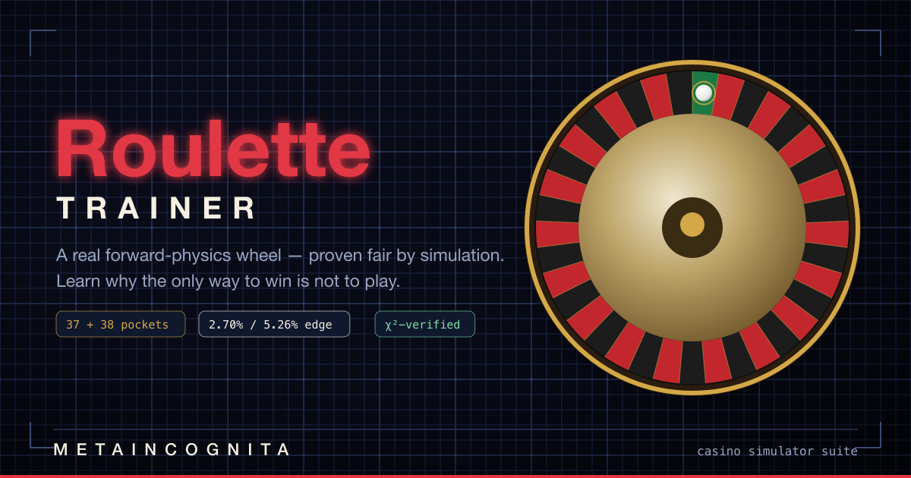

<p align="center">
  
</p>

# Roulette Trainer


A single-player, money-free **roulette simulator that is fun to play and honest about why you can't beat it.** The wheel is a real **forward-physics simulation** — the ball's landing pocket emerges from a deterministic, seeded model, not a lookup table — and the engine **proves it is fair** with a million-spin χ² test before it ships. Because roulette has no winning strategy, the whole point is to *understand* the game: the house edge lives in the pay table, every bet is the same bad deal, no betting system changes it, and the only edge that ever beat roulette is physical (a biased wheel) — which modern casinos engineer away.

> **Single-player, for education only.** No real money, no wagering, no accounts, no network play, no analytics. Bankrolls are fictitious and the app says so. This is a trainer for understanding the mathematics of roulette — not a gambling product.

## Features

- **Two regulated wheels.** Single-zero (37 pockets, European, **2.70%** house edge) and double-zero (38 pockets, American, **5.26%**). Pocket orders and colors are pinned cell-for-cell to three jurisdictions.
- **A real forward-physics wheel as the source of truth.** The ball travels ≥4 revolutions opposite the rotor, leaves the track near a diamond, and is captured at a rotor-relative angle — and *wherever it lands is the result*. Deterministic and seeded, so every spin is reproducible.
- **Proven fair, not assumed.** A 1,000,000-spin **χ² uniformity** suite plus edge-convergence tests pin the empirical house edges to **2.70% / 5.26% / 7.89% / 1.35%**. Fairness is a release gate, the same way a casino inspects a wheel.
- **The full bet & pay model.** All 14 wagers at regulated odds (35:1 down to 1:1), including the American First Five basket, plus the **La Partage** and **Surrender** even-money edge-reducers.
- **Framework-free engine.** Pure TypeScript (strict), money in integer cents, one injectable PRNG, 134 unit tests — re-skinnable and verifiable in Node.
- **A full playable trainer.** A canvas wheel that *replays* the engine's spin (Realistic or Quick), a clickable betting mat covering **every bet** — straight-ups, outside bets, and all the inside combinations (splits, streets, corners, six-lines, First Five) — with click- and drag-to-place chips that can never exceed your bankroll, a live **expected-value advisor** that explains in plain language what each bet pays and its odds, session stats with a bankroll sparkline, toast notifications, and downloadable session CSVs. Responsive down to 390px; axe-clean WCAG 2.1 AA on every route.
- **Lab · Analysis · Learn · Drills.** Detune the wheel and watch the χ² test fail in the **Lab**; compare every bet's edge and run **betting-system simulators** (Martingale · D'Alembert · Fibonacci · Paroli) with risk-of-ruin and bankroll-fan charts in **Analysis**; read how the game works, the psychology, and a long-form **history of roulette** in **Learn**; and practice in **Drills** — a quiz that teaches what every bet pays and why no bet beats the edge.

## Learn the Game

Roulette is unusual: there is no decision that improves your odds, so the most interesting thing about it is *why that is true*.

### The edge is in the pay table, not the wheel

A straight-up number pays **35 to 1**, but the true odds are **36 to 1** on a single-zero wheel and **37 to 1** on a double-zero wheel. That missing chip is the green zero (or zeros), and it is there on a *perfect* wheel. So even on a flawless wheel you lose, long-run, at a fixed rate: **2.70%** (European) or **5.26%** (American) of everything you wager.

Every bet carries that same edge — red, a corner, a dozen, a straight-up: identical expectation, differing only in *variance*. The one exception is the American **First Five** basket (0, 00, 1, 2, 3), which pays 6:1 when it should pay 6.6:1 — a **7.89%** edge, the single worst bet on the table. The biggest lever you actually control is the *table*: a single-zero wheel halves the edge, and the **La Partage / En Prison** rule (you recover half an even-money bet when zero hits) halves it again to **1.35%**.

### The drift in the wheel is the one real crack

If the math is rigged on a perfect wheel, the only place roulette has ever leaked is the *physics*. A wheel whose frets loosen, whose spindle tilts, or whose ball track wears unevenly will favor certain pockets — and that bias is the only thing that has ever beaten the game:

- **Joseph Jagger**, Monte Carlo, 1873 — hired clerks to record thousands of spins, found a biased wheel, and "broke the bank."
- **Albert Hibbs & Roy Walford**, Reno, 1947 — clocked a tilted wheel and bankrolled a sailboat.
- **Edward Thorp & Claude Shannon**, 1961 — built the first wearable computer to time the ball and rotor and predict the landing sector; the "Eudaemons" repeated the feat in the 1970s.

So the strange truth is that physical conditions move the win rate — which is exactly why casinos spend enormous effort sealing the crack: precision-balanced wheels, nightly rotation, fret swaps, and statistical surveillance (the Arizona and Colorado rulebooks in this repo *mandate* inspecting wheels for level and bias before play). The trainer's Lab makes this visceral: detune the wheel and watch a bias bloom in the histogram while the χ² test fails — the same signal an advantage player or a casino auditor hunts for.

### No betting system can work — and why we still play

Martingale, D'Alembert, Fibonacci, Labouchère: none change the expected value of a single bet, so none change the math. They only trade many small wins for rare catastrophic losses. That leaves the real question — why play a game you can't beat?

Because expected value isn't what people buy. They buy **entertainment** (the expected loss is the ticket price), **variance** (a small chance at a large win has value that EV can't see — the same reason lotteries thrive), and unfortunately a dose of **misperception** that casinos engineer. That misperception has a name: **prospect theory** (Kahneman & Tversky, 1979) — people overweight tiny probabilities (a 1-in-37 number *feels* reachable), turn risk-seeking when chasing losses, and feel a loss about twice as hard as an equivalent gain. Knowing the price, being able to afford it, and valuing the night makes roulette a fine entertainment purchase. Believing you can *win* makes it something else. The trainer exists to move you from the second to the first.

### Tidbits

- The single-zero pockets sum to 666 — roulette's "Devil's wheel" nickname.
- The ball is spun **opposite** the rotor by regulation, and must complete at least **four** revolutions for the spin to count; fewer is a "no spin."
- The winning number is marked with a **dolly** (a "crown") so no one can place a late bet on the result.

## Rules Reference

Primary sources are committed to [`docs/`](docs/) and cited inline in the engine.

| Source | Jurisdiction | Anchors |
|---|---|---|
| Appendix F(5), Tribal-State Gaming Compact | Arizona | Both wheel orders (§L), the pay table, placement geometry, ≥4-revolution rule, wheel-bias inspection |
| Crown Melbourne Roulette Rules v10.0 (VCGLR) | Victoria, AU | Wheel & mat diagrams, single/double/French variants, racetrack call bets, the dolly |
| Limited Gaming Rule 22 | Colorado | Confirms wheels & pay table, the "In Prison" edge-reducer, crown/dolly |

## Physics & Fairness

The authoritative physics lives in [`app/engine/physics.ts`](app/engine/physics.ts) as deterministic, framework-free TypeScript, so the *engine* — not a renderer — decides the pocket, and the same model runs headless in the proof. Because the ball and rotor each travel many turns, the ball's drop angle and the rotor's angle at capture are independent and ~uniform, so the landing pocket is ~uniform. That claim is not assumed — it is verified in [`app/engine/sim.ts`](app/engine/sim.ts):

- **χ² uniformity** over 1,000,000 spins per wheel, comfortably under the critical value (df = 36 / 37).
- **Edge convergence** to the published theory (2.70% / 5.26% / 7.89% / 1.35%) across multiple seeds.

A future renderer (Phaser or canvas) merely *replays* the engine's computed trajectory; it never re-derives the outcome.

## Project status

The trainer is **fully playable and responsive** — it works down to 390px and is axe-clean WCAG 2.1 AA on every route. The verified engine, the canvas wheel and the full betting mat (inside + outside bets), the place → spin → settle → bankroll loop, the live EV advisor, session history with CSV export, and the **Lab / Analysis / Learn / Drills** surfaces are all built and shipping. Design docs and plans live in [`docs/superpowers/`](docs/superpowers/); the per-release history is in [`CHANGELOG.md`](CHANGELOG.md).

## Setup

```bash
pnpm install
pnpm dev          # Nuxt 4 dev server (client-only SPA)
pnpm test         # 134 Vitest unit tests, including the 1M-spin fairness proof
pnpm typecheck    # strict TypeScript, no errors
pnpm lint         # ESLint (family config)
```

---

*Part of **Metaincognita** — a family of single-player casino simulators (Blackjack · Craps · Video Poker · Hold'em · Flameout · Pachinko · Slots · Roulette) built so that learning the real mathematics of a gambling game is more fun than gambling. One visual language, one teaching methodology, many games — built to the [Metaincognita Guidelines](docs/METAINCOGNITA-GUIDELINES-v1.1.md).*
